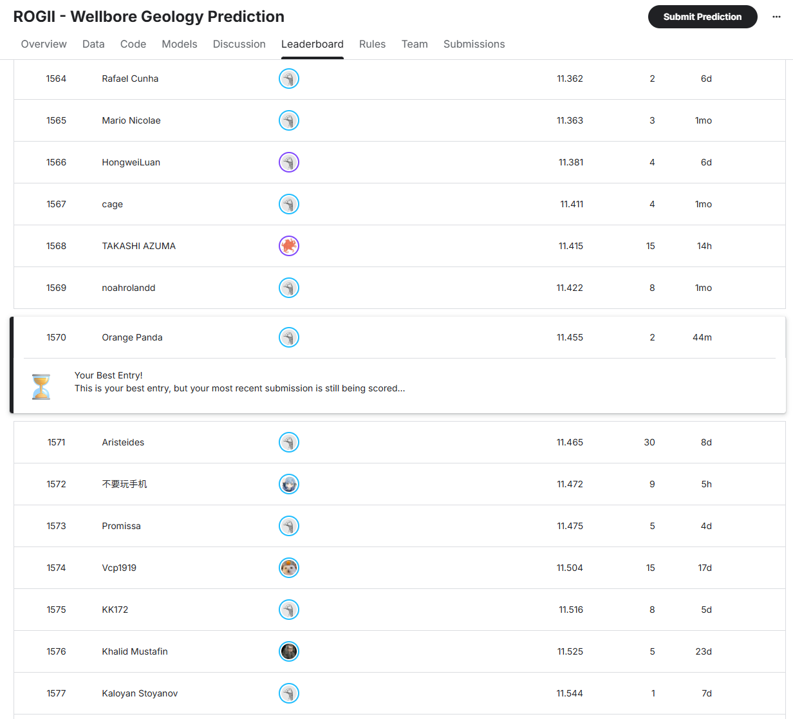

# Leaderboard

# Report

Much of our work was modelled off of the procedures from the current public
top scored [notebook](https://www.kaggle.com/code/pixiux/rogii-dual-pipeline-blend).

We built a machine learning pipeline to predict True Vertical Thickness
(TVT) along the hidden evaluation zone of horizontal wells. Our methodology starts by
treating each well as a separate sequence problem instead of a standard
flat table problem. For every well, the pipeline reads the horizontal
well file and its matching typewell file. The horizontal file provides
measured depth (`MD`), spatial coordinates (`X`, `Y`, `Z`), gamma ray
(`GR`), and `TVT_input`, while the typewell file provides known TVT,
gamma ray, and geological labels. The `TVT_input` column is used to split
the well into a known prefix and an evaluation zone. The known prefix is
where interpreted TVT values are available, and the evaluation zone is
where the model must predict TVT. The pipeline builds training rows mainly
for the evaluation-zone rows, which matches the hidden test structure and
reduces unnecessary computation. The known prefix is then used as an
anchor by extracting the last known TVT, measured depth, and spatial
position before prediction start. From this anchor, the code creates
trajectory features such as distance from the last known point, changes
in `X`, `Y`, and `Z`, horizontal displacement, and measured-depth distance
into the evaluation zone. It also estimates TVT trends from the known
prefix using slope-based baselines over the full known interval and over
recent tail windows. These features estimate how TVT would continue if
the known geological trend persisted.

Gamma ray data is handled as a major geological signal because changes in
GR often correspond to changes in lithology and geological position.
Missing GR values are interpolated when possible, and the pipeline
generates rolling means, rolling standard deviations, first-order
differences, second-order differences, and lag/lead features. These
features describe both the local value and the shape of the GR curve. The
pipeline also performs gamma ray signature matching using normalized
cross-correlation. It compares unknown GR behavior after prediction start
against the known GR and TVT pattern before prediction start across
multiple window sizes. Conceptually, this asks which part of the known GR
signature most closely resembles the current unknown GR window. The
matched TVT estimates and correlation scores are then used as model
features. The notebook also handles training-only geological formation
columns such as `ANCC`, `ASTNU`, `ASTNL`, `EGFDU`, `EGFDL`, and `BUDA`.
These raw columns exist in training data but not in hidden test data, so
direct use would create leakage and train-test mismatch. Instead, the
pipeline builds spatial formation imputers from the training wells. These
imputers learn approximate formation surfaces from training-well `X` and
`Y` locations and formation depths, then estimate comparable surfaces for
both train and test wells. During training, the current well is excluded
from its own imputation to reduce self-leakage. The imputed surfaces are
then calibrated using each well's known TVT prefix by estimating a
well-specific offset between known TVT, `Z`, and the imputed formation
surface. This creates shared train-test features such as imputed surface
depths, surface-minus-depth values, calibrated formation-based TVT
estimates, and formation spread statistics.

The target is designed as a relative displacement rather than an absolute
TVT value. Instead of training the model to predict raw `TVT`, the
pipeline predicts `TVT - last_known_tvt`. This reframes the problem as
predicting how far the geological position moves from the last known
interpreted point. This is useful because absolute TVT values can vary
across wells, while post-start movement from the known anchor is more
comparable. At inference time, the predicted delta is added back to
`last_known_tvt` to recover the final absolute TVT prediction. The model
uses LightGBM regression with GroupKFold validation grouped by well.
Grouping by well prevents rows from the same well from appearing in both
training and validation sets, which avoids overly optimistic validation
scores caused by row-level leakage. Before training, the feature list is
built from the intersection of columns that exist in both processed
training and test data, excluding identifiers such as `id`, `well`, and
the target. This ensures every training feature can also be generated at
prediction time. The feature matrix is cleaned by replacing infinite
values, filling missing values, and casting numeric columns to `float32`
for memory and runtime efficiency. During prediction, each fold model
outputs a TVT delta for the test rows, the fold predictions are averaged,
and the averaged delta is added to `last_known_tvt`. The final predictions
are merged with `sample_submission.csv` using the required `id` field and
saved as `submission.csv` with the required `id,tvt` format. It seems that
most of the top submissions use a combination of models, publically available
models, and extra data to produce a significantly lower RMSE result. Given 
the interest in time and resources and the amount of domain knowledge
needed to achieve similar results, we are happy with our current attempt.